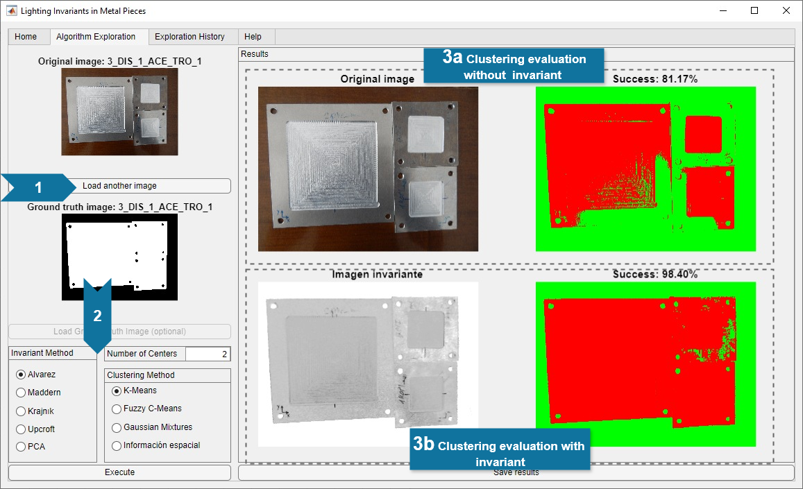

# InvIPM. Toolbox for Segmentation Optimization of Images of Metallic Objects Using Illumination-Invariant Transforms
In the case of metallic objects, the illumination will generate specular reflections and shadows, 
which must be minimized. This work proposes to apply illumination invariant transforms before image segmentation. As a case study, a set of input images with metallic parts is provided.

 

## InvIPM App description

InvIPM is MATLAB desktop application.
It allows to upload an image, to apply a set of illumination-invariant transforms, a series of clustering-based segmentation methods, and to assess the segmentation quality (if there is an image groundtruth).
 

Algorithm exploration view of the MATLAB application developed to compare the two processing proposals.

(More functions details in help view)

## Description of repository folders

- **codeapp**  contains the code of the Matlab InvIPM desktop application. It also contains the sets of input images corresponding to metal pieces and their respective groundtruths.
- **experiment** results obtained with 4 illumination invariant algorithms, 4 segmentation algorithms based on clustering approaches, and 29 images with metal parts 
acquired by factory operators and manually segmented by researchers, 
show that the application of illumination invariant transforms significantly improves the image segmentation results.

## How to install

### 1. Pre-requisites

You need to have MATLAB Runtime (R2023b) installed.
If it is not installed, you can download it from the following link [Descargar MATLAB Runtime R2023b](https://www.mathworks.com/products/compiler/mcr/index.html)

### 2.Executable files and a dataset with images of metal pieces.

- Download the executable distribution for Linux or Windows in the following repository [release](https://github.com/clopezno/InvIPM/releases)
- Run .InvP.Mexe in Windows or run.sh in Linux

## Contribution

Contributions are welcome! If you wish to contribute to this project, please follow the steps below:

1. Create a fork of the repository.
2. Create a new branch (`git checkout -b feature/new-feature`).
3. Make your changes and commit (`git commit -am ‘Add new feature’`).
4. Push your changes to the branch (`git push origin feature/new-functionality`).
5. Open a Pull Request.

## License

This project is licensed under the BSD 3-Clause License . See the [LICENSE](./LICENSE) file for details.

## Authors 

- Jonás Martínez-Sanllorente  jonasmartinez2000@gmail.com
- Carlos Lopez-Nozal clopezno@ubu.es
- Pedro Latorre-Carmona plcarmona@ubu.es
- Raúl Marticorena-Sánchez rmartico@ubu.es
